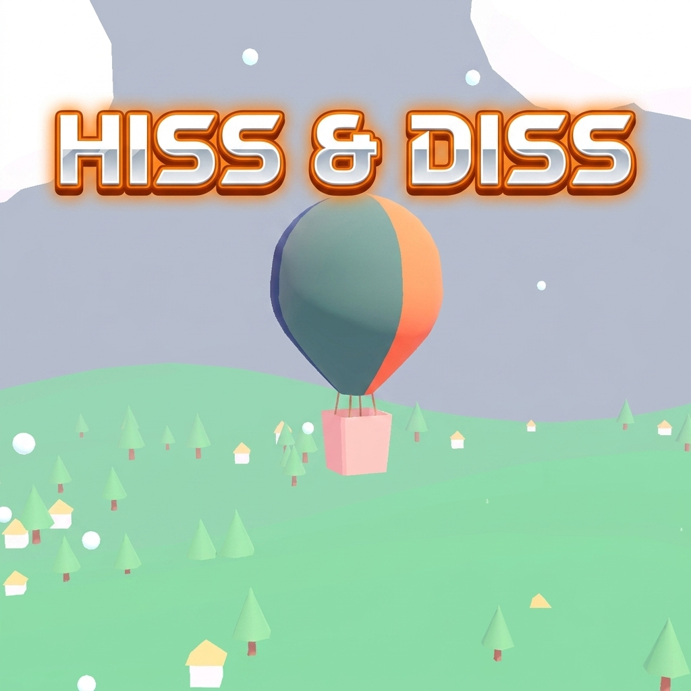

# Hiss & Diss 🎈💥

> **Hiss the burner, diss the mines — stay high in the skies!**

**Hiss & Diss** is a fast-paced 3D arcade sky-survival game built with **Godot 4**. Master your hot air balloon's burner (*Hiss*) and air vent (*Diss*) to navigate treacherous winds, dodge explosive spike mines, collect fuel canisters, and survive as long as you can!

---

## 🌟 Key Features

* 🎈 **Dynamic Buoyancy Physics**: Realistic heat and air pressure management with squash and stretch balloon dynamics.
* 💥 **Procedural 3D Explosions**: Multi-layer fireball bursts, smoke clouds, and light flashes on mine collisions.
* ⚡ **High-Altitude Arcade Gameplay**: Dodge floating spike mines and swoop down for fuel tanks.
* 🎥 **Camera & Visual Feedback**: Dynamic screen shake, hit flashes, floating popups, and smooth camera tracking.
* 🎨 **3D Graphics & Sound**: Rich world scenery, wind particles, ambient music, and sound effects.

---

## 🎮 Controls

| Action | Keyboard | Touch / On-Screen UI |
| :--- | :--- | :--- |
| **Move Left** | `A` or `Left Arrow` | `◀` Button |
| **Move Right** | `D` or `Right Arrow` | `▶` Button |
| **Hiss (Burner / Ascend)** | `Space` / `W` / `Up Arrow` | `▲ BURNER` Button |
| **Diss (Vent / Descend)** | `S` / `Down Arrow` | `▼ VENT` Button |
| **Pause Game** | `Escape` | `||` Button |

---

## 🎨 3D Assets & Credits

* 🎈 **Hot Air Balloon**: [Low-Poly Hot Air Balloon by tibayan](https://tibayan.itch.io/low-poly-hot-air-balloon)
* 💣 **Spike Mine**: [Spike Mine by Aaron Clifford](https://poly.pizza/m/4VRVeCH1sHm)

---

## 🚀 Engine & Requirements

* **Engine**: Godot 4.3+ (Forward+ / Compatibility)
* **Language**: GDScript
